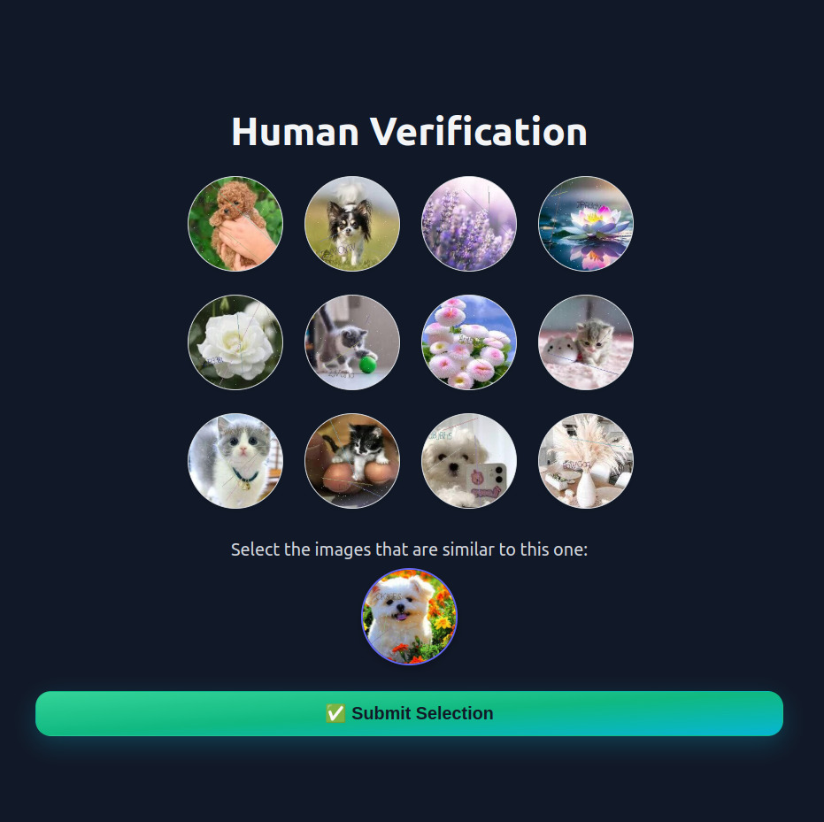

📦 Install via [Packagist](https://packagist.org/packages/forutan/captcha)  
🐙 View source on [GitHub](https://github.com/yaservaziri/ForutanCaptcha)

# 🛡️ FCaptcha — Laravel Image-Based CAPTCHA

A secure, modular, image-based CAPTCHA for Laravel with cryptographic protection and multi-context support (login, checkout, etc.). Effectively prevents automated spam in production forms.

## Table of Contents 📚

- [Features](#features)
- [Requirements](#requirements)
- [Installation](#installation)
- [Prepare CAPTCHA Images](#prepare-captcha-images)
- [Middleware Usage](#middleware-usage)
- [Configuration](#configuration)
- [Probability of Random Success](#probability-of-random-success)
- [Contributing](#contributing)
- [Support](#support)
- [Commercial License](#commercial-license)

---

## Features

- ✅ Context-aware verification per usage scenario  
- 🔐 Tokenized sessions & encrypted image access (no public URLs)
- 🔄 Random image selection + obfuscation each time (e.g. visual noise, distortions)
- 🧠 One-time URLs with secure session binding  
- 🛡️ Brute-force protection (retry limits & block durations)  
- 🌐 Middleware-ready for any route  
- ⚙️ Customizable image count, context behavior, UI  
- 🧩 Clean, modern, extendable codebase  

---



---

## Requirements

To use the `fcaptcha:prepare-images` command, [ImageMagick](https://imagemagick.org/) must be installed and available in your system's PATH:

- **Linux/macOS**: You should have the `convert` command available
- **Windows**: Install ImageMagick and ensure `magick` is accessible in your command prompt

You can verify the installation using:

```bash
# On Linux/macOS
which convert

# On Windows
where magick
```

---

## Installation

Install via Composer:

```bash
composer require forutan/captcha
```

Publish the config file (this will copy the default settings to `config/fcaptcha.php`):

```bash
php artisan vendor:publish --tag=fcaptcha-config
```

---

## Prepare CAPTCHA Images

FCaptcha requires categorized images to generate visual CAPTCHAs. You can prepare your image set using **one of these four methods (in order of priority):**

### 📁 Required Folder Structure (All Methods)

No matter which method you choose — whether a custom path, config value, built-in demo set, or published assets — the images folder must follow this categorized layout:

```bash
/your_folder
├── cat
│   ├── img1.jpg
│   ├── img2.png
├── dog
│   ├── dog1.jpeg
│   ├── dog2.png
├── flower
│   ├── tulip.jpg
│   ├── rose.png
└── ...
```

- Folder names become categories
- File names can be anything
- Supported formats: `.jpg`, `.jpeg`, `.png`

### ➊ Method 1: Custom folder path (CLI flag)

Pass the images folder path directly via `--from`:

```bash
php artisan fcaptcha:prepare-images --from=/full/path/to/your_folder
```

### ➋ Method 2: Path via Config

Set your path in `config/fcaptcha.php` like this:

```bash
'image_seed_path' => '/full/path/to/your_folder', // or base_path('your/folder') or ...
```

Then run:

```bash
php artisan fcaptcha:prepare-images
```

### ➌ Method 3: Use Built-in Demo Images

If you don't specify `--from` and leave `image_seed_path` as `null` (in `config/fcaptcha.php` ), FCaptcha will automatically use the built-in demo images from:

```bash
/vendor/forutan/captcha/database/fcaptcha_seeder
```
In this case, just run:

```bash
php artisan fcaptcha:prepare-images
```

### ➍ Method 4: Customize Built-in Images

To use and modify the internal demo set:
- Publish them:

```bash
php artisan vendor:publish --tag=fcaptcha-seeds
```

- Edit the copied files at:

```bash
storage/app/private/fcaptcha_seeder
```

- Run the preparation:

```bash
php artisan fcaptcha:prepare-images --from=storage/app/private/fcaptcha_seeder
```

> ⚠️ **Important:** After modifying your image set or resetting the database, **you must re-run** the image preparation command to sync the new data.

---

🎉 FCaptcha is now ready to power your Laravel forms with strong, customizable CAPTCHA protection.  
Enjoy secure, bot-resistant interactions — right out of the box 💻🛡️

## Middleware Usage

Apply `fcaptcha.verified:{context}` middleware to any route.

### Example: single route

```php
Route::post('/comment', function () {
    // Handle comment
})->middleware('fcaptcha.verified:comment');
```

### Example: group of routes

```php
Route::middleware('fcaptcha.verified:checkout')->group(function () {
    Route::get('/cart', 'CartController@index');
    Route::post('/checkout', 'OrderController@store');
});
```
Each `context` is verified separately.

---

## Configuration

FCaptcha comes with customizable UI and behavior. You can tweak both via Blade views and config values.

### 🖌️ Customize the CAPTCHA UI

Publish the default Blade view:

```bash
php artisan vendor:publish --tag=fcaptcha-views
```

Edit the files under:

```bash
resources/views/vendor/fcaptcha/
```

You can modify layout, texts, styles, or add your own branding.

### 🛠️ Change Behavior & Limits

Configuration file is located at `config/fcaptcha.php`.
It controls core behavior of FCaptcha — including image sizes, retry limits, category logic, and redirect behavior.

Key options:

```php
    // Where to load CAPTCHA images from (see docs above).
    'image_seed_path' => null,

    // CAPTCHA image resize dimensions (pixels) and quality.
    'default_width' => 200,
    'default_height' => 200,
    'default_quality' => 80,

    // Font used in images.
    'font_path' => base_path('vendor/forutan/captcha/resources/fonts/lightweight.ttf'),

    // Where to redirect after solving CAPTCHA per context.
    'redirect_on_pass' => [
      'default' => '/',
    ],

    // Number of images shown in grid.
    'image_count' => [
      'default' => 12,
    ],

    // How many correct images required to pass.
    'min_correct' => ['default' => 3],
    'max_correct' => ['default' => 6],

    // Token/session expiration.
    'expire_minutes' => ['default' => 2],

    // Anti-brute-force: retry limits and block times.
    'max_attempts' => ['default' => 3],    
    'block_duration_minutes' => ['default' => 60],

    // Route prefix and middleware.
    'route_prefix' => 'fcaptcha',
    'middleware' => ['web'],

    // per-route rate limiting.
    'throttle' => [
        'show' => '100,1',
        'verify' => '100,1',
        'image' => '100,1',
    ],
```

---

## Probability of Random Success

The probability of randomly solving the CAPTCHA (by pure guessing) is shown below:

> 🎯 **Formula:**  
> `P = 1 / C(n, k)`  
> where `n = total images` and `k = required correct selections`

| Correct Images (k) | Combinations (C(12, k)) | Probability       |
|--------------------|-------------------------|-------------------|
| 3                  | 220                     | ~0.45%            |
| 4                  | 495                     | ~0.20%            |
| 5                  | 792                     | ~0.13%            |
| 6                  | 924                     | ~0.11%            |

**Average success chance:** < 0.4% — providing strong protection against bots.

---

## Contributing

Have ideas for improvements? Found a bug?  
Pull requests and issues are warmly welcome — let's make FCaptcha even better together!

---

## Support

If you find FCaptcha helpful:

👉 [Donate here](https://yaservaziri.github.io/ForutanCaptcha/donate.html)

---

## Commercial License

This project is licensed under a custom non-commercial license. Usage is permitted only for personal and academic purposes. Commercial use of any kind is strictly prohibited. 
For commercial inquiries, please contact:

👉 [Request license](mailto:forutan.vaziri@gmail.com?subject=Commercial%20License%20Inquiry%20-%20FCaptcha)
